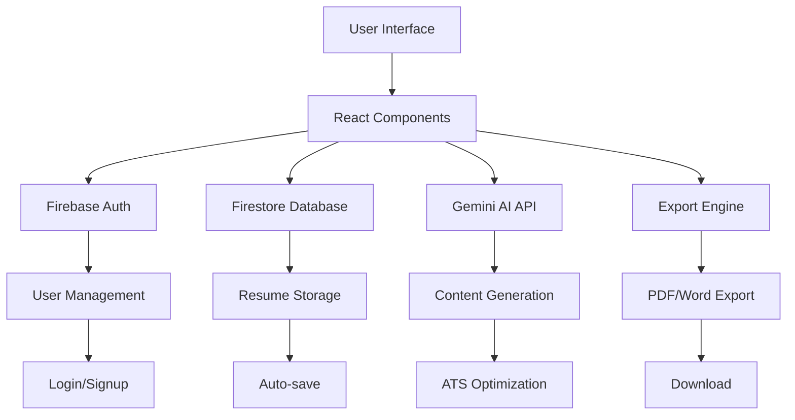

# 🤖 AI Resume Builder

> **Create professional, ATS-optimized resumes in minutes with the power of AI**

[](https://rainbow-clafoutis-fa50f5.netlify.app/)
[](https://www.youtube.com/playlist?list=PLrZbkNpNVSwz55T6S0GUK-EWWjnT9OOhs)
[](https://github.com/HorizonHnk/AI-Resume-Builder.git)


## 🚀 Features

### ✨ **AI-Powered Content Generation**
- **Smart Summaries**: Generate compelling professional summaries tailored to your experience
- **Bullet Point Enhancement**: Transform basic job descriptions into impactful achievement statements
- **Skills Suggestions**: Get relevant skill recommendations based on job descriptions
- **Job-Specific Optimization**: Tailor your resume content for specific positions

### 🎯 **ATS Optimization**
- **Compatibility Analysis**: Score your resume against ATS systems (0-100 scale)
- **Keyword Matching**: Identify missing keywords from job descriptions
- **Format Optimization**: Ensure your resume passes through applicant tracking systems
- **Improvement Suggestions**: Get actionable recommendations to boost your ATS score

### 📄 **Professional Templates**
- **Modern Professional**: Clean, contemporary design for tech and business roles
- **Creative Design**: Eye-catching layout for creative professionals
- **Executive**: Sophisticated template for senior-level positions
- **Real-time Preview**: See changes instantly as you edit

### 💾 **Cloud Storage & Management**
- **Firebase Integration**: Secure cloud storage for all your resumes
- **Auto-save**: Never lose your work with automatic saving
- **Resume Library**: Manage multiple resumes for different job applications
- **Version Control**: Track changes and maintain resume versions

### 📤 **Export Options**
- **PDF Export**: High-quality PDF generation with professional formatting
- **Word Document**: Editable .docx files for further customization
- **Direct Download**: One-click download functionality
- **Print Optimization**: Perfect formatting for both digital and print use

## 🛠️ Tech Stack

### **Frontend**
-  - Modern UI library
-  - Lightning-fast build tool
-  - Utility-first CSS framework
-  - Beautiful SVG icons

### **Backend & Services**
-  - Authentication & Database
-  - NoSQL cloud database
-  - AI-powered content generation

### **Document Processing**
-  - Word document generation
-  - Client-side file downloads

## 🏗️ Architecture Overview



## 🚦 Getting Started

### Prerequisites

Before you begin, ensure you have the following installed:
- **Node.js** (v16 or higher)
- **npm** or **yarn** package manager
- **Firebase account** (for authentication and database)
- **Google AI API key** (for Gemini AI integration)

### 📦 Installation

1. **Clone the repository**
   ```bash
   git clone https://github.com/HorizonHnk/AI-Resume-Builder.git
   cd AI-Resume-Builder
   ```

2. **Install dependencies**
   ```bash
   npm install
   # or
   yarn install
   ```

3. **Set up environment variables**
   
   Create a `.env` file in the root directory:
   ```env
   # Gemini AI Configuration
   GEMINI_API_KEY=your_gemini_api_key_here
   
   # Firebase Configuration
   VITE_FIREBASE_API_KEY=your_firebase_api_key
   VITE_FIREBASE_AUTH_DOMAIN=your_project.firebaseapp.com
   VITE_FIREBASE_PROJECT_ID=your_project_id
   VITE_FIREBASE_STORAGE_BUCKET=your_project.appspot.com
   VITE_FIREBASE_MESSAGING_SENDER_ID=your_sender_id
   VITE_FIREBASE_APP_ID=your_app_id
   
   # Environment
   NODE_ENV=development
   ```

4. **Start the development server**
   ```bash
   npm run dev
   # or
   yarn dev
   ```

5. **Open your browser**
   
   Navigate to `http://localhost:5173` to see the application running.

### 🔥 Firebase Setup

1. **Create a Firebase project** at [Firebase Console](https://console.firebase.google.com/)

2. **Enable Authentication**
   - Go to Authentication > Sign-in method
   - Enable Email/Password and Google sign-in

3. **Set up Firestore Database**
   - Go to Firestore Database
   - Create database in production mode
   - Set up security rules:
   ```javascript
   rules_version = '2';
   service cloud.firestore {
     match /databases/{database}/documents {
       match /resumes/{resumeId} {
         allow read, write: if request.auth != null && request.auth.uid == resource.data.userId;
       }
       match /users/{userId} {
         allow read, write: if request.auth != null && request.auth.uid == userId;
       }
     }
   }
   ```

4. **Get your Firebase config** from Project Settings > General > Your apps

### 🤖 Google AI (Gemini) Setup

1. **Get API key** from [Google AI Studio](https://makersuite.google.com/app/apikey)
2. **Add the key** to your `.env` file as `GEMINI_API_KEY`

## 📱 Usage

### **Creating Your First Resume**

1. **Sign up/Login** - Create an account or sign in with Google
2. **Add Personal Information** - Fill in your basic details
3. **Paste Job Description** - Add the target job description for AI optimization
4. **Generate AI Content** - Use AI suggestions for summaries, bullet points, and skills
5. **Customize Sections** - Add experience, education, projects, and certifications
6. **Choose Template** - Select from professional templates
7. **Export** - Download as PDF or Word document

### **AI Features**

> **💡 Pro Tip**: Always paste the job description first to get the most relevant AI suggestions!

- **Smart Summaries**: Click "AI Suggest" next to the summary field
- **Enhanced Descriptions**: Use "AI Enhance" on experience and project descriptions
- **Skill Recommendations**: Get relevant skills based on job requirements
- **ATS Analysis**: Check your resume's ATS compatibility score

## 🎥 Video Tutorials

Watch our comprehensive tutorial series on YouTube:

[](https://www.youtube.com/playlist?list=PLrZbkNpNVSwz55T6S0GUK-EWWjnT9OOhs)

**Tutorial Topics:**
- Getting started with AI Resume Builder
- Advanced AI features and optimization
- Export options and best practices
- ATS optimization strategies

## 🏗️ Project Structure

```
AI-Resume-Builder/
├── 📁 src/
│   ├── 📁 components/          # React components
│   │   ├── LoginPage.jsx       # Authentication
│   │   ├── SignupPage.jsx      # User registration
│   │   ├── WelcomePage.jsx     # Landing page
│   │   └── ResumeBuilder.jsx   # Main resume builder
│   ├── 📁 contexts/            # React contexts
│   │   └── AuthContext.jsx     # Authentication context
│   ├── 📁 firebase/            # Firebase configuration
│   │   └── config.js           # Firebase setup
│   ├── 📁 services/            # External services
│   │   └── firestoreService.js # Database operations
│   ├── 📁 pages/api/           # API routes
│   │   └── gemini.js           # AI API integration
│   ├── App.jsx                 # Main app component
│   ├── main.jsx               # Entry point
│   └── index.css              # Global styles
├── 📄 package.json            # Dependencies
├── 📄 vite.config.js          # Build configuration
└── 📄 .env                    # Environment variables
```

## 🤝 Contributing

We welcome contributions from the community! Here's how you can help:

### **Ways to Contribute**
- 🐛 **Report bugs** by opening an issue
- 💡 **Suggest features** or improvements
- 🔧 **Submit pull requests** for bug fixes or new features
- 📝 **Improve documentation** and tutorials
- 🎨 **Design new templates** or improve existing ones

### **Development Process**

1. **Fork the repository**
2. **Create a feature branch**
   ```bash
   git checkout -b feature/amazing-feature
   ```
3. **Make your changes**
4. **Commit your changes**
   ```bash
   git commit -m 'Add some amazing feature'
   ```
5. **Push to the branch**
   ```bash
   git push origin feature/amazing-feature
   ```
6. **Open a Pull Request**

## 🔧 Build & Deployment

### **Development Build**
```bash
npm run dev
```

### **Production Build**
```bash
npm run build
```

### **Preview Production Build**
```bash
npm run preview
```

### **Deploy to Netlify**
1. Connect your GitHub repository to Netlify
2. Set environment variables in Netlify dashboard
3. Deploy automatically on every push to main branch

## 📊 Performance

- ⚡ **Fast Loading**: Optimized with Vite for instant development
- 📱 **Responsive Design**: Works perfectly on all devices
- 🔄 **Real-time Updates**: Live preview as you type
- 💾 **Auto-save**: Never lose your work
- 🌐 **PWA Ready**: Installable as a web app

## 🛡️ Security

- 🔐 **Firebase Authentication**: Secure user management
- 🔒 **Data Encryption**: All data encrypted in transit and at rest
- 👤 **User Privacy**: Data is private and only accessible by the user
- 🛠️ **Security Rules**: Firestore rules prevent unauthorized access

## 📈 Analytics & Monitoring

- 📊 **Usage Analytics**: Track feature usage and performance
- 🐛 **Error Monitoring**: Automatic error reporting and logging
- 📈 **Performance Metrics**: Monitor app performance and optimization

## 🌟 Roadmap

### **Upcoming Features**
- [ ] **LinkedIn Integration** - Import profile data directly
- [ ] **Cover Letter Generator** - AI-powered cover letters
- [ ] **Multiple Languages** - Support for international users
- [ ] **Team Collaboration** - Share and collaborate on resumes
- [ ] **Advanced Analytics** - Detailed resume performance metrics
- [ ] **More Templates** - Industry-specific templates
- [ ] **Mobile App** - Native iOS and Android applications

## 📞 Support & Contact

### **Get Help**
- 📺 **Video Tutorials**: [YouTube Channel](https://www.youtube.com/playlist?list=PLrZbkNpNVSwz55T6S0GUK-EWWjnT9OOhs)
- 📧 **Email Support**: [hnk3693@gmail.com](mailto:hnk3693@gmail.com)
- 🐛 **Bug Reports**: [GitHub Issues](https://github.com/HorizonHnk/AI-Resume-Builder/issues)
- 💬 **Feature Requests**: [GitHub Discussions](https://github.com/HorizonHnk/AI-Resume-Builder/discussions)

### **Connect With Us**
- 🌐 **Live Demo**: [rainbow-clafoutis-fa50f5.netlify.app](https://rainbow-clafoutis-fa50f5.netlify.app/)
- 📺 **YouTube**: [Tutorial Playlist](https://www.youtube.com/playlist?list=PLrZbkNpNVSwz55T6S0GUK-EWWjnT9OOhs)
- 💻 **GitHub**: [Repository](https://github.com/HorizonHnk/AI-Resume-Builder.git)

## 📝 License

This project is licensed under the **MIT License** - see the [LICENSE](LICENSE) file for details.

## 🙏 Acknowledgments

- 🤖 **Google AI** for providing the Gemini API
- 🔥 **Firebase** for authentication and database services
- ⚡ **Vite** for the amazing build tool
- 🎨 **Tailwind CSS** for the utility-first CSS framework
- 🖼️ **Lucide React** for beautiful icons
- 👥 **Open Source Community** for inspiration and support

---

<div align="center">

### 🌟 **Star this repository if you found it helpful!** 🌟

**Made with ❤️ by [HorizonHnk](https://github.com/HorizonHnk)**

[](https://github.com/HorizonHnk/AI-Resume-Builder/stargazers)
[](https://github.com/HorizonHnk/AI-Resume-Builder/network/members)
[](https://github.com/HorizonHnk/AI-Resume-Builder/watchers)

</div>
